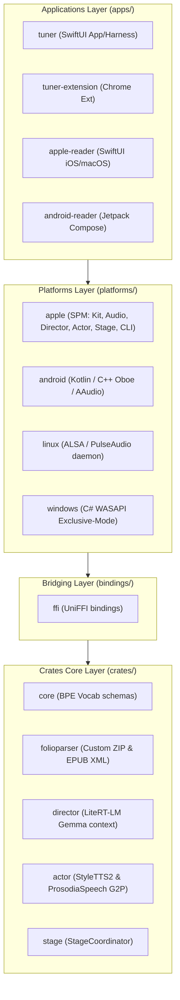

# Architecture & Development — Project Prosodia

This document consolidates the monorepo architecture layout, refactoring plans, unported logic guides, developer notes, dependency licenses, and historical engineering decisions for Project Prosodia.

---

## 1. Monorepo Architecture & Topology

The project is structured as a **Cargo Workspace Monorepo**, maintaining a clean separation between the cross-platform Rust core library, native platform adaptors (Swift/Kotlin/C#), and host applications.



### Core Components Map

*   **Core Rust Crates (`crates/`)**:
    *   **`core`**: Zero-dependency byte-level BPE (Byte-Pair Encoding) tokenizer which parses `.pvocab` binary data and merges tokens.
    *   **`folioparser`**: Zero-copy parser for EPUB structures (OPF/XML) and standard ZIP decompression via a hand-rolled reader utilizing `miniz_oxide` to keep platform cross-compilation free of C dependency collisions.
    *   **`director`**: Context orchestration, system prompting, rolling paragraph-history compilation, and Gemma 4 model inference using the LiteRT-LM C-API.
    *   **`actor`**: Voice loading (`VoiceLoader`), parametric timbre interpolation, LRU style cache, StyleTTS2 interpreter execution loop (using TensorFlow Lite C-API bindings), and G2P processing (`ProsodiaSpeech`).
    *   **`stage`**: Coordinating the narration lifecycle (`StageCoordinator`) over platform callbacks. Handles pre-render lookahead buffer queues.
*   **Platform Adaptors (`platforms/`)**:
    *   **`apple`**: Swift Package Manager package wrapping UniFFI bindings, hosting macOS/iOS `AVAudioEngine` loop buffers, and executing hardware-accelerated LiteRT models.
    *   **`android`**: Kotlin/JNI wrappers, vendored libraries, and Oboe C++ audio scheduling.
*   **Applications (`apps/`)**:
    *   **`tuner`**: SwiftUI auditioning harness for style tuning and A/B evaluations.
    *   **`tuner-extension`**: Companion Chrome extension.
    *   **`apple-reader`**: Glassmorphic iOS/macOS e-reader application.
    *   **`android-reader`**: Compose-based Android e-reader application.

---

## 2. Rust Core Migration & Refactoring Status

To guarantee platform portability, all core domain logic has been migrated into the Rust core, leaving the platform layers solely responsible for OS plumbing (UI, file I/O, audio hardware loops).

### Refactoring Stage Progress
1.  **Stage 1: Custom Rust ZIP Reader (✅ Complete)**: Removed the heavy external `zip` dependency in favor of a hand-rolled ZIP Central Directory scanner backed by `miniz_oxide` in `folioparser`.
2.  **Stage 2: G2P and Tokenizer (✅ Complete)**: Shifted phoneme-to-index mapping and text tokenization to Rust, and unified grapheme-to-phoneme under the native `ProsodiaSpeech` G2P engine inside `crates/actor` (`g2p.rs` / `lexicon.rs`). Lexicons are compiled to zero-copy binary maps at build time (no runtime JSON parse).
3.  **Stage 3: Voice Loading & Style Blending (✅ Complete)**: Ported safetensors parsing, continuous casting grid lerp arithmetic, and 3D style matrix generation to Rust `VoiceLoader`.
4.  **Stage 4: Unified Stage Coordination (✅ Complete)**: Developed `StageCoordinator` in Rust to orchestrate the lifecycle (`source` -> `director` -> `actor` -> `audio`). Features a background worker thread that pre-renders chunks up to the lookahead limit (backpressure handled via `Mutex`/`Condvar`).
5.  **Stage 5: Prune Swift Orchestration (✅ Prerequisite Complete)**: Regenerated and verified Apple SPM target compilation using dynamic xcframeworks (`build_frameworks.sh`). Pruned legacy Swift engines and G2P directories, resolving all static linking collisions.

---

## 3. Swift-to-Rust Port Status

The Swift→Rust core migration is **complete** — every component formerly slated for porting
now lives in the Rust crates, and the legacy Swift sources have been deleted.

### ✅ Ported to Rust Core (was "To Port")
*   **Misaki English G2P Engine** → `crates/actor/src/g2p.rs` + `lexicon.rs` (permissive
    lexicon, compiled to a binary map at build time; the GPL espeak-ng path is removed from the
    Apple build). `tagger.rs` / `normalization.rs` carry the POS tagging and text normalization.
*   **Actor Synthesis Orchestration** → `crates/actor/src/pipeline.rs` (phoneme walking, vocab
    filtering, dynamic style morphing via `VoiceLoader`).
*   **Prosody Markup Parser** → `crates/stage/src/markup_parser.rs`.
*   **Sentence Segmentation & Phrasing** → `crates/stage/src/segmenter.rs` + `phrasing.rs`
    (exported as `uniffi.stage.SentenceSegmenter`; no longer depends on Apple `NLTokenizer`).

### 🟦 Intentionally Kept on Platforms
*   **Audio Output:** `Audio/StageAudioSink.swift` (AVAudioEngine scheduling, micro-crossfades, and interruptions).
*   **Hardware Inference:** loading models and calling underlying C-APIs (TFLite/LiteRT-LM) on the GPU/NPU.
*   **Playback State:** `PlaybackController` pause/resume/stop loops and playback bookmarks persistence.
*   **File Downloads:** downloading missing voice packs is platform-side (fed to Rust via the `VoiceAssetProvider` bytes callback).

---

## 4. Platform Development Notes (Apple Target Caveats)

### Targets, Sandbox, and Code Signing
The `tuner` workspace features three primary Xcode schemes:
*   **ProsodiaTuner Dev** (Debug, Sandbox: **OFF**): Local development without directory read boundaries.
*   **ProsodiaTuner** (Release, Sandbox: **ON**): Shipped target. Uses security-scoped bookmarks to access model weight folders.
*   **ProsodiaTuner Harness** (Debug, Sandbox: **OFF**): Internal tuning and evaluation tool.

### SPM Workspace Local Linking
The Tuner application links the platform package locally (`../../platforms/apple`). 
> [!WARNING]
> **Environment Gotcha (Git LFS Missing Object):**
> LiteRT-LM has a missing upstream LFS object on its remote repository. When resolving or compiling via SPM, you **must** skip LFS smudging:
> ```bash
> GIT_LFS_SKIP_SMUDGE=1 swift package resolve
> GIT_LFS_SKIP_SMUDGE=1 swift build
> ```
> The macOS target is unaffected as it downloads its framework binaries separately.

---

## 5. Licensing & Dependency Policy

Project Prosodia is **Apache-2.0** (see `Prosodia/LICENSE`; the README states the same), per the
decision closed 2026-07-23 in [open-decision-licensing.md](open-decision-licensing.md).

> **Corrected 2026-08-01.** This section previously described a **GPL-3.0 + commercial dual
> license** and cited `LICENSE-COMMERCIAL.md`. That posture was abandoned along with the patent
> track; the file does not exist, and `LICENSE` is Apache-2.0. The *rationale* below changed —
> the **conclusion did not.**

Every third-party **dependency** and bundled asset must still be permissive, with no copyleft
compiled in. Under the old posture that requirement came from commercial redistribution inside
closed-source apps; under Apache-2.0 it comes from the project licence itself — a GPL dependency
compiled into an Apache-2.0 work forces the combined result to GPL, which we will not ship. The
App Store constraint is unchanged and independent of either. Same posture as
[architecture-north-star.md §8](architecture-north-star.md), which also governs which
**datasets/checkpoints** may enter the production corpus.

*   **No Copyleft Compilation**: GPL/AGPL dependencies are strictly banned from compilation.
*   **Dynamic Isolation for espeak-ng**: If copyleft G2P tools (like GPLv3 `espeak-ng`) are required, they must remain optional and dynamically weak-linked as an isolated binary plugin (`CLibEspeak`) that default builds simply do not package.

### Dependency Audit Grid
| License Family | Compliance Level | Shipped App Impact |
|---|---|---|
| **MIT / Apache-2.0 / BSD / ISC** | ✅ Preferred | Permissible to modify and distribute in a closed app. Requires retaining copyright notices. |
| **MPL-2.0** | 🟡 Acceptable with care | File-level copyleft. Any modifications to the MPL files themselves must be published, but they can be linked to closed apps. |
| **LGPL** | ⚠️ Avoid | Static linking combined with App Store code-signing creates legal friction. Do not adopt without an approved isolation plan. |
| **GPL / AGPL** | 🚫 Incompatible | Shipped application inherits copyleft requirements. GPL terms are incompatible with Apple App Store distribution terms. |

---

## 6. Historical & Resolved Decisions

### DECISION 1 — Rust G2P Crate (`ProsodiaSpeech`)
*   **Resolution:** Opted to build our own permissive-licensed, zero-dependency `ProsodiaSpeech` G2P engine natively in Rust (`crates/actor/src/g2p.rs`) instead of linking espeak-ng (GPL copyleft risk) or porting the heavy `Misaki` Swift code line-for-line.

### DECISION 2 — Dynamic Parametric Voicing Grid
*   **Resolution:** Implemented continuous bilinear interpolation inside the `VoiceLoader` style mixer to resolve `age_profile` and `masculinity` against 6 continuous timbre anchors, plus style texture blending (vocal raspiness) against gruff anchors.

### DECISION 3 — Cache Policy
*   **Resolution:** Upgraded `VoiceCache` from a simple FIFO structure to a true access-ordered LRU (Least Recently Used) cache policy capping memory footprint at 16 loaded style vector profiles.

### DECISION 4 — Bounded Lookahead pre-render queue
*   **Resolution:** Rejected complex async frameworks in favor of a worker thread in the stage coordinator. Thread-safe `VecDeque` pre-renders chunks up to the limit (default 4). Mutex and `Condvar` implement natural backpressure. A limit of `0` falls back to synchronous inline rendering.
