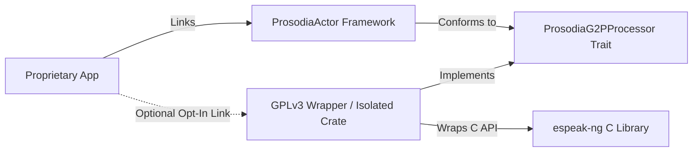

# High-Ambition 4 — 🌐 Native Multilingual G2P Liaison Engine

> **Sequence:** 4 of 5 — broadens beyond English once the English production quality of the
> [1 — Matcha-TTS actor](../Sonora/high-ambition-1-matcha-actor.md) through
> [3 — Child Voices](high-ambition-3-child-voices.md) is solid; precedes the optional
> [5 — StyleTTS2-Lite](../Sonora/high-ambition-5-styletts2-lite.md) re-platform. **Base-independent** — this is
> a G2P/front-end concern, unaffected by the acoustic-model choice. The cross-compilation + bridge
> wrapper tasks here are already largely **done**; remaining work is integration/opt-in packaging.

This engineering note describes the architecture and compliance strategy for packaging a native C `espeak-ng` engine for cross-platform App Store compatibility.

---

## 🎯 Objective
Package the compiled C version of `espeak-ng` as an optional, isolated FFI wrapper target to enable offline, high-fidelity multilingual grapheme-to-phoneme (G2P) processing (handling sandhi, word boundaries, and French *liaisons*) without violating GPLv3 requirements or contaminating proprietary App Store client applications.

---

## 🏛️ Context & Challenge
Supporting multilingual speech synthesis requires a rule-based G2P engine capable of context-aware phonetic conversions. While `espeak-ng` is the industry standard for this task, it is licensed under **GPLv3**. 

Directly static-linking GPLv3 code into a proprietary application is a violation of GPLv3 and Apple App Store distribution policies (since static linking combines the codebase into a single binary, forcing copyleft inheritance). To make Prosodia attractive to commercial developers, we must architect a strict licensing and technical boundary.

---

## 🛡️ Decoupling & Compliance Strategy

To utilize `espeak-ng` while keeping the core `crates/actor` and proprietary client apps clean of GPLv3 contamination, we adopt a decoupled dynamic-loading approach:

1.  **Trait-Oriented Abstraction**: Define a G2P trait interface (operating on `MToken` arrays carrying `tag` and `whitespace` parameters) in the permissively-licensed (`Apache-2.0`) core framework (`crates/actor`). The core speech engine depends only on this trait interface, not on `espeak-ng` directly.
2.  **Isolated Crate (`espeak-ng-sys`)**: Package the compiled C code of `espeak-ng` in a separate, isolated Rust crate that commercial developers do not compile/link by default.
3.  **Dynamic Loading / Weak Linking**:
    *   For mobile platforms, compile the GPLv3 wrapper as a dynamic library (`.dylib` / `.so`).
    *   Load the dynamic library at runtime using `dlopen` and look up symbols via `dlsym`, or configure it as an optional FFI plug-in target.
    *   If the library is missing, the engine gracefully falls back to the native `ProsodiaSpeech` G2P processor (our zero-dependency, permissive G2P engine) or simple dictionary lookups.

---

## 🛠️ Implementation Tasks

### 1. Cross-Compilation Toolkit
*   [x] Create a dynamic wrapper package containing the compiled C source files of `espeak-ng`. (Completed)
*   [x] Configure build flags to support cross-compilation for iOS, macOS, Android, Windows, and Linux. (Completed)
*   [x] Bundle the required dictionaries and phoneme data files as resources. (Completed)

### 2. Direct Bridge Wrapper
*   [x] Implement a bridge wrapper conforming to the Rust G2P trait. (Completed)
*   [x] Establish direct C-to-Rust bridging (bypassing slow shell processes or subprocess execution) to interact directly with the compiled C library APIs (`espeak_ng_Initialize`, `espeak_ng_Synthesize`, etc.). (Completed)
*   [x] Manage memory lifecycle and thread safety inside the bridge wrapper to prevent memory leaks during rapid text processing. (Completed)
