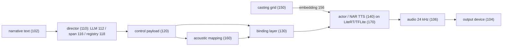
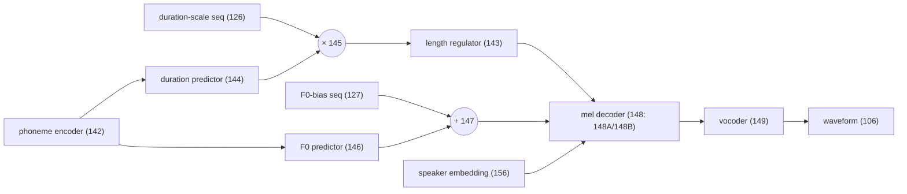
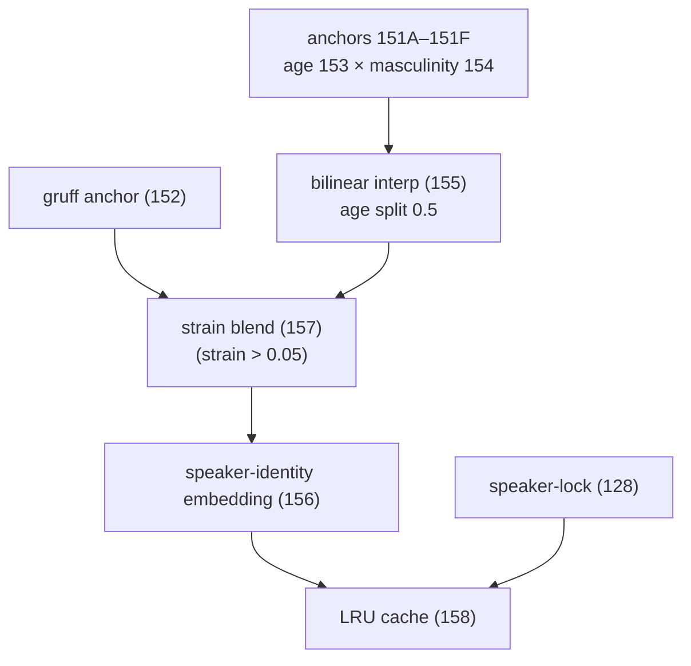
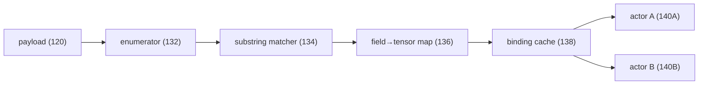
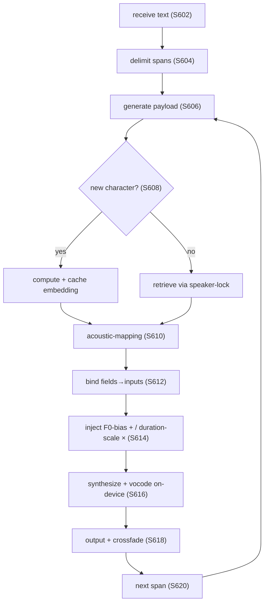
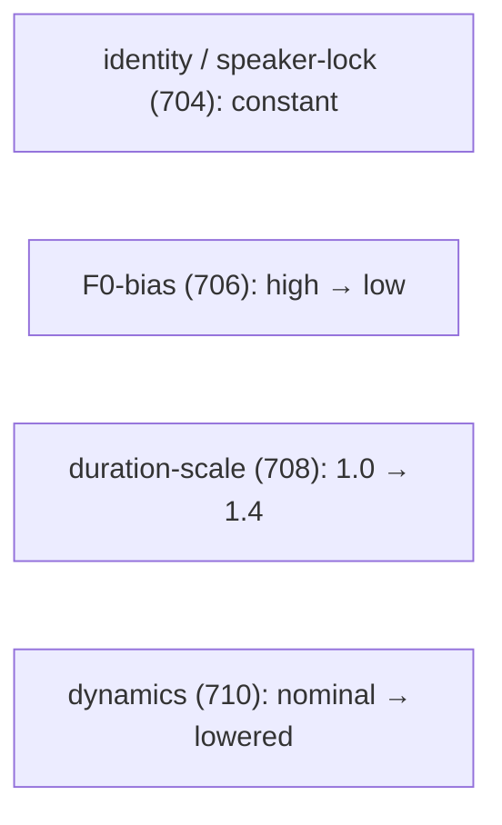

# Patent Disclosure — Director↔Actor Expressive Control (invention capture of record)

> Capture-of-record for the **second** patent-track invention: the on-device **Director→Actor
> disentangled prosody + voice-casting control engine** — distinct from the narrative-knowledge-graph /
> spoiler-Q&A invention. This file preserves the material fed to and refined with **PatSnap Eureka**
> (an AI patent-drafting tool), so the inputs aren't lost between Eureka round-trips.
>
> **Status (updated 2026-08-01): NO PATENT TRACK REMAINS — both inventions, defensive posture,
> fully Apache-2.0.** The owner confirmed 2026-08-01 that patenting is not being pursued at all:
> the repo carries a **defensive statement** and everything ships open. The patent idea belonged
> to an earlier **dual-licensing strategy (GPL-3.0 + commercial) that has since been abandoned** —
> `LICENSE` is Apache-2.0 and there is no `LICENSE-COMMERCIAL.md`. Read this file as an
> **invention capture of record**, not as an active filing track. Decision:
> [open-decision-licensing.md](open-decision-licensing.md).
>
> Superseded status (2026-07-13): "defensively published — no filing planned for *this*
> invention", which left the narrative-knowledge-graph / Q&A invention described as a separate
> track that "remains private and was NOT published." **That distinction is gone** — there is no
> second track, and nothing is being held back for filing.
>
> The defensive publication for the expressive-control mechanism is at
> `Prosodia/docs/defensive-publication-expressive-control.md` (public repo, commit `946bcc2`).
> This capture file remains the richer internal record; the Eureka material below is retained for
> reference only.
>
> ⚠️ Note: the repo-root `PATENT.md` referenced below **no longer exists**. References to it in
> this file are historical.
>
> **Source of truth for the grounded specifics** (coefficients, grammar, binding layer) is the actual
> code: `crates/stage/src/{prosody.rs, prosody_payload.rs, acoustic_matrix.rs}` and
> `crates/actor/src/{voice_loader.rs, pipeline.rs, engine.rs}`. Related notes:
> [architecture-north-star.md §2](architecture-north-star.md) (this engine is the *ownable core*),
> [voicing-synthesis-and-tuning.md](voicing-synthesis-and-tuning.md),
> [director-narrative-memory.md](director-narrative-memory.md),
> [voice-interruption-and-discussion.md](voice-interruption-and-discussion.md).

## Relationship to the other patent track

The incremental-narrative-knowledge-graph + spoiler-free Q&A invention (the original `PATENT.md`, now
superseded in that file) is a **separate application**. In *this* expressive-control application the
Q&A/graph appears only as a brief cross-referenced optional embodiment — **not** as independent claims —
to avoid a USPTO restriction requirement and double-patenting. Voice interruption ("Solo Book Club") is
captured in [voice-interruption-and-discussion.md](voice-interruption-and-discussion.md); the knowledge
substrate in [director-narrative-memory.md](director-narrative-memory.md).

## Truth-check note (Eureka's 2026-06-20 output)

Eureka's disclosure report was substantially faithful (the V/A/T ranges, the casting grid, the control
contract / binding layer all matched the code). The corrections that became Part 1 of the supplemental
brief below: (1) the actor's mel/waveform sampler is **stochastic** (flow-matching temperature ≈0.667 /
diffusion) — claim "deterministic prosodic *dictation*," not "acoustically identical output"; (2) don't
narrow the actor to "flow-matching" — it's non-autoregressive broadly (StyleTTS2-style today, Matcha
target); (3) runtime is **LiteRT/TFLite**, not CoreML; (4) the "trained-to-obey per-token conditioning"
actor is the **planned directability fine-tune** (next-steps milestone 3), not yet built.

---

## 1. Invention disclosure brief (initial — fed to Eureka)

```
INVENTION DISCLOSURE — for patent draft generation

TITLE (suggested)
Director-Dictated Disentangled Prosody and Voice-Casting Control for On-Device Expressive Speech Narration

TECHNICAL FIELD
On-device text-to-speech (TTS) narration systems; specifically, automatic generation of a typed,
per-span performance-control payload by a language-model "director" and its application by a neural
"actor" TTS model to dictate separable prosodic and vocal-identity channels, including per-token pitch
and duration control, and to synthesize multiple stable character voices without per-character
recordings.

PROBLEM / BACKGROUND (technical deficiencies in prior art)
Existing expressive/controllable TTS suffers from one or more of the following:
1. ENTANGLEMENT: identity (timbre) and prosody (emotion, pitch, rate, energy) are encoded in a single
   style vector or derived from a single reference audio clip, so increasing emotional intensity also
   drifts the speaker's apparent identity (e.g., a male voice shifting female, a young voice aging).
   This makes it impossible to hold identity constant while directing a performance.
2. SUGGESTION, NOT DICTATION: control is exposed only as free-text prompts or coarse tags that "steer"
   an autoregressive model rather than dictating precise, reproducible acoustic targets; output drifts
   chapter-to-chapter and cannot be precisely directed at sub-sentence granularity.
3. RECORDING DEPENDENCE: producing multiple distinct character voices (a "full cast") requires
   per-character voice recordings or reference clips / voice cloning; voices cannot be invented from
   parameters alone.
4. CLOUD DEPENDENCE: high-quality expressive control typically runs server-side, precluding private,
   offline, deterministic on-device narration.
No prior system provides an automatically-generated, typed, machine-readable, per-span AND per-token
control contract that DICTATES separable acoustic channels (identity, emotion, dynamics/effort, pitch,
pacing) to an on-device neural TTS model, enabling one channel to be varied while another is held fixed,
and synthesizes stable invented character voices by parametric interpolation — all on-device.

SUMMARY OF THE INVENTION
A speech-narration system comprising:
(A) a DIRECTOR module — an on-device language model (e.g., a small instruction-tuned LLM running on an
    on-device LLM runtime) that reads narrative text and emits, per text span, a TYPED PERFORMANCE-
    CONTROL PAYLOAD encoding separable channels: (i) vocal identity/timbre (casting), (ii) emotion as a
    valence/arousal/tension (V/A/T) vector, (iii) dynamics / vocal effort, (iv) pitch, and (v) pacing /
    duration;
(B) a CONTROL CONTRACT — a serialized, machine-readable markup/grammar carrying the payload (per-span
    scalar channels PLUS per-token sequences for fine-grained control), forming a model-agnostic
    interface between the director and the actor;
(C) an ACTOR module — a neural (non-autoregressive) TTS model that RENDERS speech by APPLYING the
    payload as conditioning inputs, INCLUDING per-token pitch-bias and per-token duration-scale tensors
    injected into the model's fundamental-frequency (F0) and duration predictors, plus a speaker-
    embedding/style vector for identity, such that the actor OBEYS the dictated channels rather than
    merely being suggested toward them; and
(D) a CONTINUOUS PARAMETRIC CASTING GRID — generates a speaker-identity/style vector for any character
    by interpolating among a small set of timbre anchors along continuous axes (e.g., age and
    masculinity) and blending a vocal-texture axis (e.g., smoothness↔strain/rasp), thereby synthesizing
    novel, stable character voices WITHOUT per-character recordings.
Because identity and prosody are carried in SEPARATE channels the director writes independently, the
system can hold one channel fixed while varying another.

REPRESENTATIVE IMPLEMENTATION DETAIL (for enablement)
- Emotion is represented as a vector of valence (e.g., −1..1), arousal (−1..1), and tension (0..1)
  [also referred to as a VAD/V-A-T vector].
- The per-span payload includes: a speed/rate multiplier and bias; a dynamics/gain multiplier and bias;
  a pitch term; a casting profile {age, masculinity, strain/rasp}; a speaker-lock identifier for cross-
  chapter identity stability; a pause/timing multiplier; a pronunciation override; AND per-token
  sequences of duration scales and F0 (pitch) biases.
- The payload is serialized as a compact tagged markup (e.g., bracketed channels such as
  [V: A: T: speed: gain: pitch: age: masculinity: strain: speaker-lock: per-token-duration:
  per-token-F0: ...]) parsed by the actor.
- A configurable acoustic-mapping stage converts the V/A/T vector into baseline speed, dynamics, and
  pitch targets (with special handling for, e.g., low-valence high-arousal "shout" cases), which the
  per-token sequences then refine.
- The casting grid performs bilinear interpolation over timbre anchors spanning female/male ×
  child/adult/elderly, plus a texture blend toward a gruff/raspy anchor, producing the actor's
  conditioning vector; cached per character.
- The actor model exposes named conditioning input tensors; the runtime detects which inputs the loaded
  model provides (phonemes, style/speaker, speed, emotion vector, per-token duration scales, per-token
  F0 biases) and binds the payload to them, so the SAME control contract drives different actor models.
- The director runs on an on-device LLM runtime; the actor runs as an on-device neural TTS model
  (non-autoregressive flow-matching or equivalent) exported to a mobile inference runtime; the entire
  text→performance→audio pipeline executes on-device.

POINTS OF NOVELTY (emphasize these in the claims)
1. Automatic generation, by an on-device LLM director from narrative text, of a TYPED per-span control
   payload that SEPARATES identity, emotion (V/A/T), dynamics, pitch, and pacing into independently-
   written channels.
2. DICTATED control via per-token (frame-level) F0-bias and duration-scale tensors injected into the
   TTS model's pitch and duration predictors — fine-grained, reproducible control reaching INSIDE
   synthesis, enabling sub-sentence dynamics.
3. DISENTANGLEMENT enabling a first channel (e.g., identity) to be held constant while a second (e.g.,
   dynamics + pitch) is varied — and vice versa.
4. A CONTINUOUS PARAMETRIC CASTING GRID that synthesizes stable, novel character voices by parametric
   interpolation WITHOUT per-character recordings or reference clips.
5. A MODEL-AGNOSTIC control contract decoupling the director/control from the acoustic model, so the
   actor model is swappable behind a stable interface.
6. Fully ON-DEVICE director + actor pipeline (privacy, offline operation, determinism).

REPRESENTATIVE EMBODIMENTS
- "The hush": the director lowers dynamics and pitch and slows pacing for a span via the dynamics,
  pitch, and per-token channels while holding the identity/casting channel and speaker-lock constant,
  so the SAME narrator audibly lowers his voice without changing who is speaking.
- "Full cast": the director assigns a distinct casting profile per character/line (each generated by the
  casting grid, each speaker-locked for stability across the book) while each character independently
  carries its own emotion channel.
- Spoiler-aware casting gate (related application): a gate compares director-generated casting
  parameters against the user's reading position and overrides them to a neutral profile until the
  corresponding character trait is disclosed in the text, preventing "voice spoilers."
- Model-agnostic embodiment: a second actor model implementing the same conditioning interface is
  substituted without changing the director or the control contract.
- On-device embodiment: the director is a small instruction-tuned LLM on an on-device LLM runtime; the
  actor is a non-autoregressive neural TTS exported to a mobile runtime.

TECHNICAL ADVANTAGES
Identity-stable directed performance across a long work; precise, reproducible, sub-sentence prosodic
control; a full cast of distinct stable voices with no per-character recordings; privacy/offline/
deterministic on-device operation; and an actor model that can be upgraded without changing the
director or the control contract.

SUGGESTED CLAIM SET (concepts for the tool to formalize)
- Independent system claim covering (A)–(C): director generating the typed separable-channel per-span
  payload; actor rendering by applying it as conditioning including per-token F0-bias and duration-scale
  inputs; with one channel varied while another is held constant.
- Independent method claim: generating the payload from text and rendering by dictated conditioning.
- Independent non-transitory computer-readable-medium claim.
- Dependent claims: the V/A/T emotion vector; the per-token F0/duration injection into the model's
  pitch/duration predictors; the continuous parametric casting grid (age × masculinity interpolation);
  the strain/rasp texture blend; the speaker-lock for cross-chapter identity stability; the serialized
  tagged-markup contract; the model-agnostic/swappable actor; the on-device LLM director + on-device
  non-autoregressive actor; the "hush" (hold identity, lower dynamics/pitch mid-span); the "full cast"
  (per-line casting + per-voice emotion); and the spoiler-aware casting gate.

SCOPING NOTES FOR THE DRAFTING TOOL (do not omit)
- This is a DISTINCT invention from the applicant's other application directed to an incremental
  narrative knowledge graph and spoiler-free question-answering. Do NOT center this draft on Q&A,
  knowledge graphs, or spoiler prevention; the casting gate is a single optional embodiment only.
- Keep the implementation ON-DEVICE. Do NOT default the director to cloud LLMs or the actor to legacy
  vocoder examples; the director is an on-device LLM and the actor is an on-device neural (non-
  autoregressive) TTS model. Cloud/server variants may be listed only as non-preferred alternatives.
- The point of novelty is the DICTATED, DISENTANGLED, per-span-AND-per-token control contract and the
  recording-free casting grid — not merely "expressive TTS." Center the claims there.
```

---

## 2. Supplemental technical detail & corrections (second pass — fed to Eureka)

```
SUPPLEMENTAL TECHNICAL DETAIL & CORRECTIONS — incorporate into the next draft

PART 1 — CORRECTIONS TO THE PRIOR ANALYSIS (accuracy)

1A. Do NOT claim "deterministic, acoustically identical output across runs."
    The actor's mel/waveform generator is GENERATIVE and may be stochastic — e.g., a conditional
    flow-matching (OT-CFM) decoder sampled at a non-zero temperature (≈0.667), or a diffusion-based
    style sampler. Output is therefore not bit-identical across runs unless a fixed random seed and/or
    zero-temperature sampling is used. What IS deterministic is the DICTATED prosodic TARGET: the
    per-token F0-bias and duration-scale values are exact, externally-supplied inputs, not sampled.
    Replace "deterministic, reproducible acoustic output" with "deterministic prosodic DICTATION
    (exact per-token pitch/duration targets), with optionally reproducible synthesis under a fixed
    sampling seed." Keep "dictation vs. suggestion" as the point of novelty; drop "acoustically
    identical."

1B. Do NOT narrow the actor to "flow-matching."
    The actor is NON-AUTOREGRESSIVE with an explicit duration predictor and an F0/pitch predictor.
    Embodiments include (i) a flow-matching/OT-CFM decoder AND (ii) a non-flow-matching NAR model with
    a diffusion/GAN vocoder (e.g., a StyleTTS2-style architecture). Claim broadly: "a non-autoregressive
    neural TTS model having a duration predictor and a fundamental-frequency predictor." Recite
    "flow-matching" ONLY in a dependent claim. (The currently-implemented actor is the StyleTTS2-style
    variant; the flow-matching variant is the target — both must be covered.)

1C. Runtime correction.
    Director = an on-device LLM (e.g., a Gemma-class instruction-tuned model) executed on an on-device
    LLM runtime (e.g., LiteRT-LM). Actor = a NAR TTS exported via torch -> ONNX -> TFLite (onnx2tf) and
    executed on an on-device runtime (LiteRT / TFLite). List ONNX Runtime Mobile / CoreML only as
    alternative runtimes; the implemented path is LiteRT/TFLite. Output sample rate 24 kHz.

1D. Honesty on the per-token "obey" mechanism.
    The control contract and the per-token F0/duration plumbing EXIST today. An actor TRAINED to consume
    per-token F0-bias and duration-scale as external conditioning inputs (rather than internal
    predictions) is a planned fine-tuning step, not yet completed. Describe the trained-to-obey actor as
    a planned/preferred embodiment; do not assert it as reduced to practice. (For a StyleTTS2-style
    actor the values can override the model's predicted F0/duration curves at inference; for a
    flow-matching actor they are supplied as conditioning the model is trained to accept.)


PART 2 — §112 ENABLEMENT DETAIL TO ADD (fills the four flagged gaps)

2A. Origin of the timbre anchor embeddings (gap #1).
    Each of the six anchors (female/male x child/adult/elderly) is a low-dimensional style/speaker
    embedding (e.g., a 64-dimensional StyleTTS2 style vector) obtained from an existing voice asset
    ("voice pack"), i.e., extracted via the model's reference/style encoder from a reference voice or
    stored as a pre-computed embedding. The grid interpolates among these pre-existing anchor
    embeddings; no per-character recording is used at casting time.

2B. The acoustic-mapping function, with a concrete example (gap #2).
    The V/A/T vector is first scaled by a tunable expressiveness scalar E (example E = 3.25):
       v' = v*E,  a' = a*E,  t' = t*E.
    Baseline targets (example coefficients; all tunable):
       speed   = clamp( 1.0 + 0.08*a' - 0.10*t' + 0.05*v',  0.65, 1.12 )
       gain    = clamp( 1.0 + 0.25*a' + 0.08*v',            0.60, 1.20 )
       pitch (semitone-like F0 offset), piecewise:
         if a' >= 0:
            let raw = max(0, -v) * a          // uses UNAMPLIFIED v, a
            if raw >= 0.75:  pitch = -8 * ( max(0,-v') * a' * t' )   // "angry shout": effort up, pitch down
            else:            pitch = min(15, 12*t' + 3*a')
         if a' < 0:
            if v < 0:        pitch = -( 6 * max(0,-a') * t' )
            else:            pitch = min(15, 4 * max(0,-a'))
    These per-span baselines are then refined by the per-token sequences (2C).

2C. Per-token injection specifics.
    f0_bias[token] is an ADDITIVE offset applied to the predicted F0 contour; duration_scale[token] is a
    MULTIPLICATIVE factor (example: duration_scale = 1 / rate) applied to predicted token durations.
    Both per-token sequences are smoothed by a moving average (example window = 5 tokens) before being
    applied, to avoid discontinuities. This is what enables mid-sentence dynamics (e.g., a hush that
    deepens across a clause).

2D. Worked example of the runtime binding layer (gap #4).
    The actor exposes named input tensors; the binding layer matches payload fields to inputs by
    case-insensitive substring of the tensor name:
       phonemes/text      <- name contains "x" | "phone" | "input_ids" | "text"
       style/speaker      <- "style" | "ref"
       speed/tempo        <- "speed" | "tempo"
       emotion vector     <- "vat" | "emotion" | "control"
       per-token duration <- "duration_scale" | "dur_scale"
       per-token F0       <- "f0_bias" | "pitch_bias"
    Payload fields with no matching input tensor are ignored. The SAME serialized payload thus drives
    different actor models exposing different subsets of inputs (model-agnostic contract). (A model is
    detected as the flow-matching variant when it exposes the characteristic input set, e.g.,
    x + x_lengths + scales.)

2E. Example serialization grammar (concrete, for written-description support).
    Per span: [V:<v> A:<a> T:<t> S:<speed> SB:<speed_bias> G:<gain> GB:<gain_bias> AG:<age> MA:<masc>
    ST:<strain> LK:<speaker_id> PB:<pause_mult> P:<pitch> DS:<dur_scale_seq> FB:<f0_bias_seq>]
    Example: "[V: -0.50 A: 0.70 T: 0.85 P: -5.0] and grabbed her throat!"

2F. Casting-grid math (for enablement of the grid claims).
    Age split into two segments at a = 0.5. For age a and masculinity m (each in [0,1]):
       segment low/high anchors chosen by age (child-adult for a<=0.5, adult-elderly for a>0.5);
       gender mix:  V_lowAge  = (1-m)*V_female_lowAge  + m*V_male_lowAge;  similarly V_highAge;
       age mix:     V_identity = (1-a')*V_lowAge + a'*V_highAge,  where a' rescales the segment to [0,1].
    Texture/strain blend (applied when strain r > 0.05):
       V_voice = (1-r)*V_identity + r*V_gruff_anchor.
    The resulting embedding is cached per character identifier (e.g., an LRU cache, example capacity 16),
    guaranteeing an identical voice for that character across all spans (reinforced by the speaker-lock
    field).


PART 3 — WORKED EMBODIMENTS TO ADD (demonstrate disentanglement)

3A. "The hush" (single-narrator, identity held constant).
    For one span, the director holds the casting/identity channel and speaker-lock CONSTANT while
    lowering dynamics (gain < 1.0), lowering pitch (negative pitch term plus negative per-token f0_bias),
    and slowing pacing (speed < 1.0, per-token duration_scale > 1.0, increased pause multiplier). Effect:
    the SAME narrator audibly lowers his voice (quieter, breathier, deeper, slower) WITHOUT any change
    in perceived speaker identity — a manipulation impossible in entangled style-vector systems. The
    per-token sequences let the hush deepen mid-sentence.

3B. "Full cast" (multi-character, per-line identity switch).
    For each character the director assigns a distinct casting profile {age, masculinity, strain}; the
    casting grid synthesizes a distinct, stable voice; the speaker-lock pins each character's voice
    across the entire work; and each character independently carries its OWN V/A/T emotion. Narrator and
    character voices alternate at quote boundaries, each remaining identity-stable across chapters.


PART 4 — CLAIM-DRAFTING & SCOPING INSTRUCTIONS

4A. Lead independent claim: the per-token F0-bias / duration-scale injection (most distinguishing
    feature; no anticipatory prior art). Recite a NON-AUTOREGRESSIVE actor with a duration predictor and
    an F0 predictor receiving externally-supplied per-token tensors from the director. Keep
    "flow-matching" to a dependent claim (per 1B).
4B. Separately claim the continuous parametric casting grid (2D-axis age x masculinity bilinear +
    texture blend axis + per-character cache + no-recording limitation).
4C. Separately claim the model-agnostic control contract + runtime binding layer (per 2D).
4D. KEEP THE Q&A / NARRATIVE-KNOWLEDGE-GRAPH EMBODIMENT AS A BRIEF CROSS-REFERENCED OPTIONAL EMBODIMENT
    ONLY. Do NOT draft independent claims for the incremental knowledge graph or no-spoiler Q&A in THIS
    application — that subject matter is the basis of a SEPARATE pending application; independent claims
    here would invite a restriction requirement and double-patenting issues. (Remove Recommendation 4's
    push for independent Q&A claims.)
4E. Keep the entire pipeline ON-DEVICE in all primary claims/embodiments; cloud/server variants only as
    non-preferred alternatives. Do not re-genericize the director to cloud LLMs or the actor to legacy
    vocoder families.
```

---

## 3. Correction pass — accuracy / truthfulness (third brief, fed to Eureka)

> Context: Eureka's second draft incorporated the Part-1/Part-2 corrections well, but **fabricated
> empirical results** presented as actual measurements (ablation studies, MOS scores, ABX listening
> tests, RTF/latency numbers, embedding-distance thresholds, dollar figures) — an untruth and an
> inequitable-conduct risk for a real filing, since no trained directable model, benchmark, or user
> study exists yet. It also slipped in factual errors (Phi-3-mini instead of Gemma 4; an invented
> L2-normalization step; a 20 ms crossfade vs. the documented 5–10 ms). This third brief is the
> subtractive/fix pass. Verified against `crates/director/src/lib.rs` (Gemma 4 = only supported
> director backend) and `crates/actor/src/voice_loader.rs` (shape/weight normalization, not L2).

```
CORRECTION PASS — accuracy and truthfulness. This is a SUBTRACTIVE/FIX pass. Do NOT add new
features, new metrics, or new examples. Keep all existing technical detail that is not flagged below.

GLOBAL RULE — NO UNVERIFIED EMPIRICAL CLAIMS
This application is filed before the system has been empirically benchmarked. Therefore:
- REMOVE every asserted experimental result, measurement, benchmark, study, or quantitative
  performance figure that is presented as having been obtained. This includes ablation studies, MOS
  scores, listening tests (ABX), speaker-similarity percentages, F0/duration error figures, real-time
  factors, tokens/sec, latency in ms/seconds, embedding-distance thresholds, "10,000 voices," dollar
  cost figures, and parameter counts attributed to named systems.
- Any forward-looking capability MUST be written as a PROPHETIC example in present/future tense
  ("is expected to," "in a contemplated embodiment," "can be configured to," "may achieve"). Do NOT use
  past tense or assertive phrasing such as "ablation studies show," "empirical testing demonstrates,"
  "in user studies," or "achieves [number]."
- Qualitative claims are fine (e.g., "enables identity to remain substantially constant while emotion
  varies"); specific measured numbers are not, unless explicitly cited to a named external publication.

SPECIFIC ITEMS TO REMOVE OR CONVERT TO PROPHETIC/QUALITATIVE
- §3 Problem 1: delete ">15% speaker similarity score degradation (measured by cosine similarity of
  d-vector embeddings)." Keep the qualitative point that perturbing entangled style dimensions drifts
  timbre.
- §3 Problem 2: delete "F0 trajectory variance on the order of 2–5 semitones and duration variance on
  the order of 10–20% per phoneme." Keep the qualitative non-determinism point.
- §3 Problem 3: delete the dollar figures ("$200–$500 per hour," "$8,000–$40,000 per title"); replace
  with "substantial per-character recording and studio cost." Keep SV2TTS/YourTTS qualitative point.
- §3 Problem 4: delete the parameter counts (~400M) and "real-time factors greater than 1.0"; replace
  with "large autoregressive models are typically too computationally costly for real-time inference on
  mobile hardware."
- §4.D: DELETE entirely the sentence "Empirical testing demonstrates that characters with Euclidean
  distance greater than 0.15 … >90% accuracy in ABX forced-choice listening tests." Replace with a
  prophetic qualitative statement: "Embeddings that are sufficiently separated in the normalized
  embedding space are expected to yield perceptually distinct character voices."
- §5 Effect 1: delete "In ablation studies … less than 5% speaker similarity score change … vs greater
  than 15% … GST-based baselines." Reframe prophetically: holding the identity channel constant while
  varying emotion "is expected to leave perceived speaker identity substantially unchanged," which is
  not achievable in entangled style-vector systems.
- §5 Effect 2: delete "less than 0.5 semitone mean absolute error … less than 2% relative error …
  across inference runs." Keep the (correct) point that the per-token targets are exact, externally
  supplied inputs (dictation, not sampling), and retain the existing stochastic-sampler caveat.
- §5 Effect 3: delete "less than 1ms per character" and "at least 10,000 perceptually distinct character
  voices." Replace with "low marginal computational cost per additional character" and "a large,
  continuous space of distinct character voices."
- §5 Effect 4: delete "50–200 tokens per second," "approximately 0.5–2 seconds per span," and
  "real-time factor below 0.3." Replace with "executes on-device at interactive speed." ALSO fix the
  model name (see FACTUAL CORRECTIONS).
- §5 Effect 6: change "up to 2,048 tokens of preceding context" to "preceding narrative context"
  (no number). DELETE the entire MOS/user-study sentence ("In user studies … MOS … 4.2 … 3.1 … 3.6 …
  PromptTTS"); replace with a prophetic statement that LLM-directed typed-payload direction is expected
  to yield more contextually coherent expressiveness than free-text prompt steering.
- §6 Application 1: delete the numeric performance figures ("3–8 spans per paragraph," "0.5–2 seconds,"
  "real-time factor < 0.3," "less than 3 seconds … 500-word chapter"). Change "20ms crossfade" to "a
  short crossfade (e.g., 5–10 ms)." Keep the qualitative workflow steps.
- §6 Application 2: delete the dollar/hour comparison ("100 hours … $300/hour … $30,000"); replace with
  a qualitative statement that many NPCs can be voiced from the small set of anchors plus parametric
  specification, without per-character recording.
- §6 Applications 3–4: the duration_scale example multipliers (1.5×, 1.8×, 2.0×) and the V/A/T example
  profiles are illustrative CONTROL INPUTS, not results — KEEP them.
- §10 Secondary Considerations: soften unverifiable assertions ("more than 15 years," "hundreds of
  millions of e-book readers") to qualitative phrasing, or remove.
- §9 / §10 prior-art characterizations: do NOT assert internal specifics of the cited references that
  are not actually disclosed by them (e.g., specific embedding dimensions, "5 preceding and 5 following
  sentences"). Keep prior-art descriptions limited to what each reference actually discloses; flag for
  attorney verification. Remove the "Novelty risk: Low/Medium" labels from the specification body
  (these are attorney work-product, not specification text).

FACTUAL CORRECTIONS (match the actual implementation)
- DIRECTOR MODEL: the on-device director is Gemma 4 (an instruct-tuned Gemma-class model) on
  LiteRT-LM, and is the only supported director backend. In §5 Effect 4, REMOVE "Gemma-3B or Phi-3-mini"
  and replace with "Gemma 4." Do not reference Phi-3 anywhere.
- L2-NORMALIZATION: DELETE the claim that anchor/identity embeddings are "L2-normalized" (in §4.D and in
  the §112 Area-1 proposed language). The implementation normalizes voice-pack tensor shape and
  normalizes blends by total weight — it does NOT L2-unit-normalize embeddings. Either remove the
  normalization clause or describe it as "weight-normalized when blending."
- ACTOR TRAINING SPECIFICS: in §4.C and §112 Area-3, mark CREPE pitch tracking (10ms), Montreal Forced
  Aligner, and "conditioning dropout p = 0.2" as ONE ILLUSTRATIVE, CONTEMPLATED training approach —
  not the definitive method. Phrase as "in one contemplated training procedure …"
- ILLUSTRATIVE-ONLY DETAILS: keep but clearly mark as examples ("e.g.", "in one embodiment"), not as
  the definitive mechanism: the 512-token max span and clause-split rule; the `[CHARACTER:Alice]`
  speaker-attribution markup; the MessagePack/Protocol Buffers binary option; the per-`(model_hash,
  schema_version)` binding cache.

DO NOT REGRESS — PRESERVE THESE EXACTLY (they are verified-accurate and correctly framed)
- The V/A/T ranges (valence/arousal [−1,+1], tension [0,1]).
- The acoustic-mapping piecewise formula and its example coefficients (speed, gain, and the pitch
  piecewise function including the angry-shout case).
- The casting-grid interpolation math (age split at 0.5, gender mix, age mix, strain blend > 0.05).
- The tagged-markup control grammar and its worked example.
- The runtime binding layer via case-insensitive substring matching of input-tensor names.
- "NAR actor; StyleTTS 2-style currently implemented, flow-matching/OT-CFM the planned target"; do NOT
  put "flow-matching" in the independent claim (dependent only).
- The honest reduction-to-practice framing (the trained-to-obey actor is planned, not built).
- The determinism caveat (the mel/waveform sampler is stochastic; full reproducibility needs a fixed
  seed/zero temperature).
- On-device LiteRT-LM (director) + LiteRT/TFLite (actor), 24 kHz, torch→ONNX→TFLite via onnx2tf.
- The "hush" and "full cast" worked embodiments and their example payload fragments.
- Recommendation 4: keep the read-progress-scoped Q&A as a cross-referenced optional embodiment ONLY,
  with NO independent claims in this application.
- All independent claims recite on-device execution.
```

---

## 4. Drawings package (figure descriptions, reference numerals, conceptual diagrams)

> For the formal application. The disclosure-analysis report currently has no figures; this is the
> figure set, a self-consistent reference-numeral scheme, the "Brief Description of the Drawings"
> section, detailed per-figure descriptions, and conceptual Mermaid diagrams. The numeral series is
> independent of the narrative-graph patent's 100-series (each application numbers its own figures).
> Final figures must be formal black-line drawings per 37 CFR 1.84 — these are conceptual drafts for a
> draftsperson.

### Reference-numeral scheme
- 100 system · 102 narrative text input · 104 audio output device · 106 output audio waveform (24 kHz)
- 110 Director module · 112 on-device LLM (Gemma 4) · 114 on-device LLM runtime (LiteRT-LM) ·
  116 span delimiter · 118 character registry / speaker-lock store
- 120 typed control payload (contract) · 121 casting/identity channel (age/masc/strain) ·
  122 emotion (V/A/T) · 123 dynamics (gain) · 124 pitch · 125 pacing (speed/pause) ·
  126 per-token duration-scale seq · 127 per-token F0-bias seq · 128 speaker-lock id ·
  129 pronunciation override
- 130 binding layer · 132 input-tensor enumerator · 134 substring matcher · 136 field→tensor map ·
  138 binding cache
- 140 Actor module (NAR TTS; 140A/140B alternative models) · 142 phoneme/text encoder ·
  143 length regulator/aligner · 144 duration predictor · 145 duration-scale injection (×) ·
  146 F0 predictor · 147 F0-bias injection (+) · 148 mel decoder (148A StyleTTS2-style / 148B flow-matching) ·
  149 neural vocoder
- 150 casting grid · 151 six timbre anchors (151A–151F) · 152 gruff/texture anchor · 153 age axis ·
  154 masculinity axis · 155 bilinear interpolation · 156 character speaker-identity embedding ·
  157 strain/texture blend · 158 embedding LRU cache
- 160 acoustic-mapping stage · 170 on-device inference runtime (LiteRT/TFLite)
- Method steps S602–S620 · Hush figure 700 (702 token axis, 704 constant-identity, 706 F0-bias curve,
  708 duration-scale curve, 710 dynamics track)

### Brief description of the drawings
- FIG. 1 — block diagram of on-device expressive narration system 100.
- FIG. 2 — schematic of typed control payload 120 and its independent channels.
- FIG. 3 — actor module 140, illustrating per-token F0-bias 147 and duration-scale 145 injection.
- FIG. 4 — continuous parametric casting grid 150.
- FIG. 5 — model-agnostic binding layer 130 driving two actor models 140A/140B.
- FIG. 6 — flowchart of method 600.
- FIG. 7 — timeline 700 of a "hush" embodiment (identity constant; prosody varied).

### Detailed figure descriptions
- **FIG. 1.** System 100 receives narrative text 102. Director 110 (on-device LLM 112 on runtime 114,
  span delimiter 116, character registry 118) emits typed payload 120 per span. Acoustic-mapping 160
  converts emotion channel 122 to baseline targets. Binding layer 130 maps payload 120 fields to the
  inputs of actor 140 (on runtime 170), which synthesizes waveform 106 to output device 104. Casting
  grid 150 supplies speaker-identity embedding 156 to actor 140.
- **FIG. 2.** Payload 120 channels: casting/identity 121, emotion 122, dynamics 123, pitch 124,
  pacing 125; per-token sequences 126/127; speaker-lock 128; pronunciation override 129. Serialized as
  tagged markup.
- **FIG. 3.** Phoneme encoder 142 feeds duration predictor 144 and F0 predictor 146. Per-token
  duration-scale 126 is applied multiplicatively at 145; per-token F0-bias 127 additively at 147. Length
  regulator 143 aligns phonemes to frames. Mel decoder 148 (148A StyleTTS2-style / 148B flow-matching),
  conditioned on speaker embedding 156, drives vocoder 149 → waveform 106.
- **FIG. 4.** Casting grid 150: six anchors 151A–151F over age axis 153 × masculinity axis 154, plus
  gruff anchor 152; bilinear interpolation 155 (age split at 0.5); strain blend 157 (strain > 0.05) →
  embedding 156 in LRU cache 158, retrieved via speaker-lock 128.
- **FIG. 5.** Binding layer 130: enumerator 132 reads actor input tensors; substring matcher 134 builds
  field→tensor map 136 (unmatched fields discarded), cached at 138. Same payload 120 drives actor 140A
  and actor 140B unmodified.
- **FIG. 6.** Method 600: S602 receive text; S604 delimit spans/attribute speakers; S606 generate
  payload; S608 new-character compute+cache else retrieve via speaker-lock; S610 acoustic-mapping;
  S612 bind fields→inputs; S614 inject per-token F0-bias (+) and duration-scale (×); S616 synthesize +
  vocode on-device; S618 output + crossfade; S620 next span.
- **FIG. 7.** Timeline 700 over token axis 702: constant-identity track 704 (speaker-lock 128 fixed);
  descending F0-bias curve 706; rising duration-scale curve 708; lowered dynamics track 710 — the same
  narrator's voice lowered without identity change.

### Conceptual diagrams (Mermaid — same numerals)

FIG. 1 — system architecture


FIG. 3 — actor internals (per-token injection)


FIG. 4 — casting grid


FIG. 5 — model-agnostic binding


FIG. 6 — method flowchart


FIG. 7 — "the hush" (draftsperson renders as a 4-track timeline over token axis 702)

